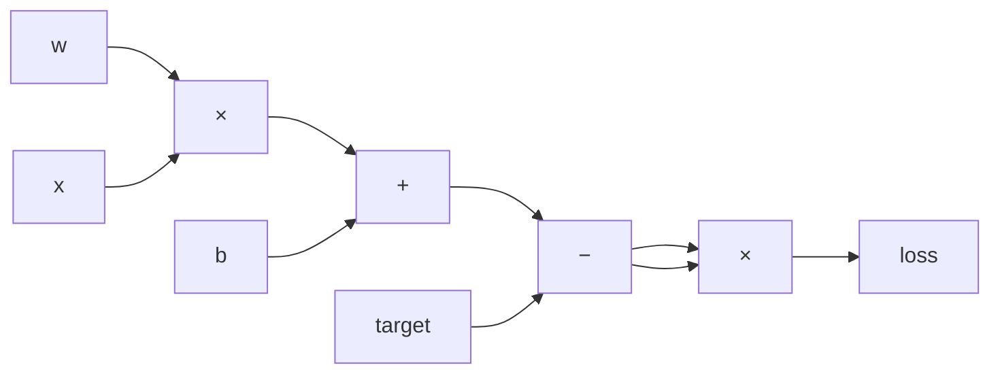

# 03 让数值记住计算过程

有限差分通过反复扰动输入来估计梯度。为了更高效地求导，我们让每次运算创建一个节点，并记录它依赖的输入以及本地导数。

## 从表达式得到一张图

计算 `loss = (w × x + b - target)²` 时，会经历多个中间值。把这些值连起来，就得到一张有向无环图：边从输入指向依赖它的结果。



每个节点保存三类信息：当前数值、父节点，以及每条父边上的局部导数。对加法 `z = a + b`，局部导数是 `dz/da = 1`、`dz/db = 1`；对乘法 `z = ab`，分别是 `b` 和 `a`。

平方这里写成 `error * error`，因此乘法节点的两个父边指向同一个对象。不能因为父节点相同就删掉一条边；两条路径对梯度的贡献都要保留。

配套代码把减法写成加上相反数，取相反数再表示为乘以 `-1`。所以计算图会显示一个乘以 `-1` 的节点；它的局部导数就是 `-1`。

## 先记录，不急着反传

配套程序创建图并按依赖顺序打印节点：

```bash
python 'book/代码/01-标量自动微分/03-计算图.py'
```

本章的 `Value` 暂时不计算最终梯度。它只记录数据流和局部导数，让我们能够检查：最终损失用了哪些输入，每一步运算的局部斜率是什么。

输出中，损失节点的两个父边都指向数值为 `-3` 的误差节点；乘法两条边的局部导数也都是 `-3`。这两条边不能合并，因为反向传播需要把两份贡献都加回误差节点。

## 为什么图要从结果往回走

前向计算从输入开始，逐步得到输出。求某个参数对最终损失的影响时，可以从输出往回走：把上游梯度乘以当前边的局部导数，再把贡献加到父节点上。

如果一个节点通过多条路径影响结果，它收到的梯度是各条路径贡献之和。第四章会把这个规则写成 `backward()`，并按反向拓扑顺序处理节点。

## 练习

1. 对 `z = a + b` 和 `z = a × b`，分别写出两个输入的局部导数。
2. 让程序打印 `error * error` 的父节点，确认两条父边指向同一个误差对象。
3. 在记录图的版本中加入幂运算 `a ** 3`，它对 `a` 的局部导数是什么？
